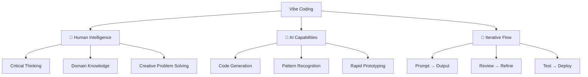
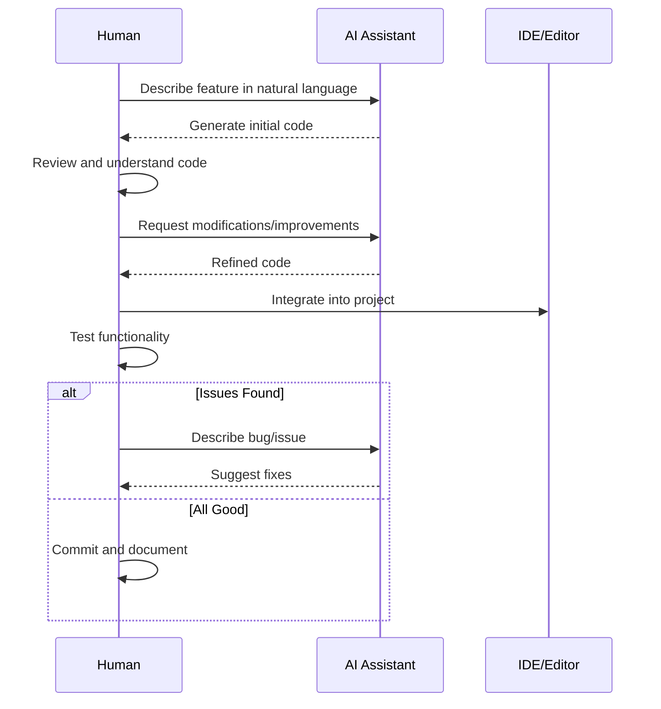

# 🧠 01 - What Is Vibe Coding?

> **"Vibe Coding" is the art of building software by directing AI with intuition, creativity, and strategic thinking.**  
> It's not about replacing developers—it's about amplifying human potential with AI as your 24/7 pair programmer.

---

## 📖 Table of Contents

- [Definition](#definition)
- [The Evolution of Programming](#the-evolution-of-programming)
- [Core Principles](#core-principles)
- [Vibe Coding vs Traditional Coding](#vibe-coding-vs-traditional-coding)
- [The Vibe Coding Workflow](#the-vibe-coding-workflow)
- [Key Concepts](#key-concepts)
- [Common Misconceptions](#common-misconceptions)
- [Real-World Examples](#real-world-examples)
- [Self-Assessment](#self-assessment)
- [Next Steps](#next-steps)

---

## 🎯 Definition

**Vibe Coding** (also known as AI-Assisted Development or AI-Pair Programming) is a modern software development approach where:

> Developers leverage AI models to generate, review, debug, and optimize code through natural language conversations, focusing on high-level architecture, logic, and user experience while AI handles repetitive implementation details.

### The Three Pillars of Vibe Coding



---

## 📜 The Evolution of Programming

| Era | Time Period | Tools | Developer Role |
|-----|-------------|-------|----------------|
| **1.0 Manual** | 1950s-1980s | Punch cards, Assembly | Every bit matters |
| **2.0 High-Level** | 1980s-2000s | C, Java, IDEs | Logic & structure |
| **3.0 Framework** | 2000s-2010s | Rails, Django, React | Configuration & glue |
| **4.0 AI-Assisted** | 2020s-Present | Copilot, Claude, Cursor | Direction & review |
| **5.0 Autonomous** | Future | AI Agents | Strategy & oversight |

### Why Now?

The shift to vibe coding happened because:

1. **AI Models Matured**: LLMs now understand context, patterns, and can generate production-ready code
2. **Tooling Improved**: IDEs integrated AI natively (Cursor, Copilot, Codeium)
3. **Speed Demands**: Market expects faster MVPs and iterations
4. **Knowledge Democratization**: Beginners can build what previously required years of experience

---

## 💎 Core Principles

### 1. **Intent Over Implementation**
Focus on *what* you want to build, not *how* to write every line.

```markdown
❌ Traditional: "I need to write a for loop to iterate through this array..."
✅ Vibe Coding: "Filter this list to show only active users under 30"
```

### 2. **Iterative Refinement**
Rarely get perfect code on first prompt. Embrace the cycle:

```
Prompt → Review → Identify Issues → Refine Prompt → Better Output → Test → Deploy
```

### 3. **Verification is Key**
Trust but verify. AI makes mistakes. Always:
- ✅ Read the generated code
- ✅ Understand the logic
- ✅ Test edge cases
- ✅ Validate security implications

### 4. **Context is King**
Better context = better output. Provide:
- Business requirements
- Technical constraints
- Existing codebase patterns
- Performance expectations

### 5. **Human in the Loop**
AI suggests, humans decide. You remain responsible for:
- Architecture decisions
- Security & privacy
- User experience
- Ethical considerations

---

## ⚡ Vibe Coding vs Traditional Coding

| Aspect | Traditional Coding | Vibe Coding |
|--------|-------------------|-------------|
| **Speed** | Hours to days for features | Minutes to hours |
| **Learning Curve** | Years to master syntax | Days to learn prompting |
| **Focus** | Syntax, patterns, debugging | Logic, architecture, UX |
| **Tools** | IDE, debugger, docs | AI assistant + IDE |
| **Errors** | Manual debugging | AI helps identify & fix |
| **Boilerplate** | Write everything | AI generates instantly |
| **Knowledge** | Memorize APIs | Ask AI for examples |
| **Refactoring** | Time-consuming | Quick AI-assisted rewrites |

### Productivity Comparison

```
Traditional Developer (8 hours):
├── 2h: Research & planning
├── 4h: Writing code
├── 1.5h: Debugging
└── 0.5h: Testing

Vibe Coder (8 hours):
├── 1h: Planning & prompting
├── 1h: Reviewing AI output
├── 2h: Integration & customization
├── 1h: Testing
└── 3h: Building MORE features
```

---

## 🔄 The Vibe Coding Workflow

### Standard Workflow



### Daily Workflow Example

**Morning Session:**
1. ☕ Review yesterday's code and tests
2. 📝 Plan today's features with AI brainstorming
3. 🚀 Generate boilerplate and scaffolding

**Deep Work Session:**
4. 🏗️ Build core logic with iterative prompting
5. 🔍 Review, refactor, and optimize with AI suggestions
6. 🧪 Write tests (AI-generated, human-verified)

**Afternoon Session:**
7. 🔧 Debug issues with AI pair debugging
8. 📚 Document code and update README
9. 🎯 Plan tomorrow's tasks

---

## 🔑 Key Concepts

### 1. **Prompt Engineering**
The skill of crafting effective instructions for AI.

**Example Progression:**
```markdown
Level 1 (Basic): "Create a login form"

Level 2 (Better): "Create a React login form with email and password"

Level 3 (Advanced): 
"Create a React login form component with:
- Email validation (RFC 5322)
- Password strength indicator (min 8 chars, 1 number, 1 special char)
- Remember me checkbox
- Forgot password link
- Error handling for network failures
- Accessibility (ARIA labels, keyboard navigation)
- Styled with Tailwind CSS
- TypeScript types included"
```

### 2. **Context Window Management**
Understanding AI's memory limits and providing relevant context.

**Best Practices:**
- Keep prompts focused (500-2000 tokens ideal)
- Reference specific files when needed
- Summarize previous conversations for continuity
- Use system prompts for consistent behavior

### 3. **Code Review Mindset**
Shift from writer to reviewer/editor.

**Questions to Ask:**
- ❓ Does this solve the problem correctly?
- ❓ Are there security vulnerabilities?
- ❓ Is the code efficient and readable?
- ❓ Does it follow our project conventions?
- ❓ Are edge cases handled?

### 4. **Progressive Disclosure**
Build incrementally, revealing complexity gradually.

```
Step 1: Basic functionality works
Step 2: Add error handling
Step 3: Optimize performance
Step 4: Add logging/monitoring
Step 5: Write comprehensive tests
```

---

## 🚫 Common Misconceptions

| Myth | Reality |
|------|---------|
| "AI will replace developers" | AI replaces tasks, not jobs. Developers who use AI will replace those who don't. |
| "You don't need to know coding" | Understanding fundamentals helps you verify and guide AI effectively. |
| "AI code is always buggy" | With good prompts and review, AI produces production-quality code. |
| "It's cheating" | It's leveraging tools, like using a calculator for math. |
| "Only for simple projects" | Complex systems are built by composing AI-generated components. |
| "You lose control" | You gain control over more of the stack by moving faster. |

---

## 🌟 Real-World Examples

### Example 1: Startup MVP

**Scenario:** Solo founder building a SaaS product

**Traditional Approach:**
- 3 months to build MVP
- Hire 2-3 developers ($30k+)
- Delayed market entry

**Vibe Coding Approach:**
- 2 weeks to build MVP
- Solo developer + AI
- Launch, get feedback, iterate quickly

**Tech Stack Generated:**
```
Frontend: Next.js + Tailwind CSS + shadcn/ui
Backend: Supabase (Auth + Database)
Payments: Stripe integration
Deployment: Vercel
```

### Example 2: Enterprise Migration

**Scenario:** Migrating legacy PHP app to modern stack

**Traditional:**
- 6-month timeline
- Large team coordination
- High risk of regression

**Vibe Coding:**
- AI analyzes existing code
- Generates migration plan
- Converts code module by module
- Auto-generates tests
- 2-month timeline, smaller team

### Example 3: Learning Journey

**Student Profile:** No coding experience

**Month 1:** Learn basics with AI tutor
**Month 2:** Build simple web apps
**Month 3:** Create portfolio projects
**Month 4:** Land first freelance gig

---

## 📊 Self-Assessment

### Where Are You on the Vibe Coding Spectrum?

**Score yourself (1-5) on each:**

| Skill | Rating | Description |
|-------|--------|-------------|
| **Prompt Clarity** | _/5 | Can you clearly describe what you want? |
| **Code Reading** | _/5 | Can you understand AI-generated code? |
| **Debugging** | _/5 | Can you identify and fix issues? |
| **Architecture** | _/5 | Can you design system structure? |
| **Verification** | _/5 | Do you thoroughly test AI output? |

**Scoring:**
- **5-10**: Beginner - Focus on sections 02-07
- **11-17**: Intermediate - Jump to domain-specific sections (08-15)
- **18-25**: Advanced - Explore monetization and advanced topics (16-29)

---

## 🛠️ Practical Exercises

### Exercise 1: First Vibe
**Goal:** Experience the flow

1. Open your AI assistant
2. Prompt: "Create a simple HTML page with a counter button"
3. Copy the code to a file
4. Open in browser
5. Celebrate! 🎉

### Exercise 2: Iterative Improvement
**Goal:** Practice refinement

1. Start with basic prompt from Exercise 1
2. Add requirements one by one:
   - "Add styling to make it look modern"
   - "Add a reset button"
   - "Save the count to localStorage"
   - "Add animations"
3. Notice how each iteration improves the result

### Exercise 3: Bug Hunt
**Goal:** Develop verification skills

1. Ask AI to create a function with a subtle bug
2. Try to find the bug without running code
3. Run and test to confirm
4. Ask AI to fix it
5. Compare your findings with AI's fix

---

## 📚 Recommended Resources

### Articles & Blogs
- [The Rise of AI Pair Programmers](https://example.com)
- [Prompt Engineering Best Practices](../07-prompt-engineering/)
- [From Zero to Ship: A Vibe Coding Journey](../27-case-studies/)

### Videos
- [Introduction to Vibe Coding (YouTube)](https://youtube.com)
- [Building Apps with Claude (Tutorial)](https://youtube.com)
- [Cursor IDE Walkthrough](https://youtube.com)

### Tools to Explore
- [Cursor](https://cursor.sh/) - AI-native IDE
- [GitHub Copilot](https://github.com/features/copilot) - Code completion
- [Claude](https://claude.ai/) - Conversational AI
- [Replit AI](https://replit.com/) - Browser-based development

---

## 🎯 Next Steps

Now that you understand what vibe coding is:

1. ✅ **Complete**: Read [02 - How to Start](../02-how-to-start/) for actionable steps
2. ✅ **Setup**: Review [03 - Hardware Guide](../03-hardware-guide/) for optimal setup
3. ✅ **Master**: Study [07 - Prompt Engineering](../07-prompt-engineering/) for maximum efficiency
4. ✅ **Practice**: Start building with guidance from section 02

---

## 💬 Discussion Questions

Think about these and share in discussions:

1. What's your biggest concern about AI-assisted coding?
2. Describe a task you'd love to automate with AI
3. What programming experience do you have (if any)?
4. What type of projects interest you most?

---

> **💡 Pro Tip**: The best way to learn vibe coding is to start small, ship often, and gradually tackle more complex projects. Don't aim for perfection—aim for progress!

---

<div align="center">

**Ready to start your journey?**  
➡️ [Next: How to Start](../02-how-to-start/) ⬅️

[⬆️ Back to Introduction](../00-introduction/)

Made with ❤️ by the Vibe Coding Community

</div>
