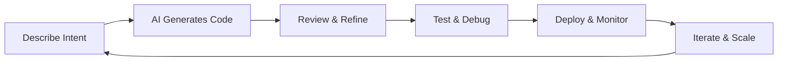
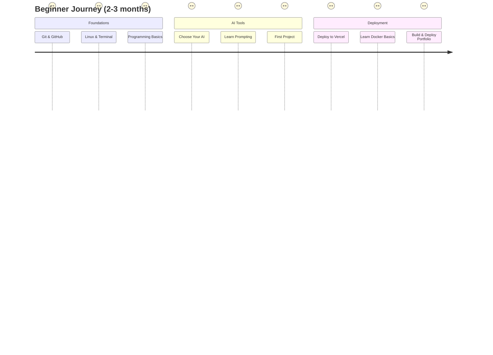
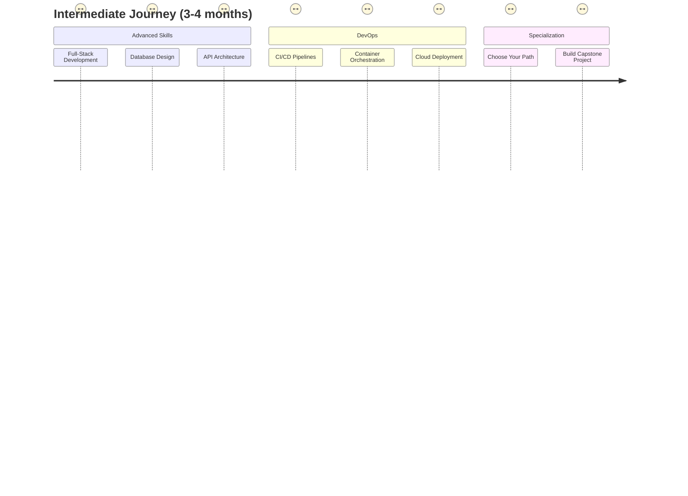
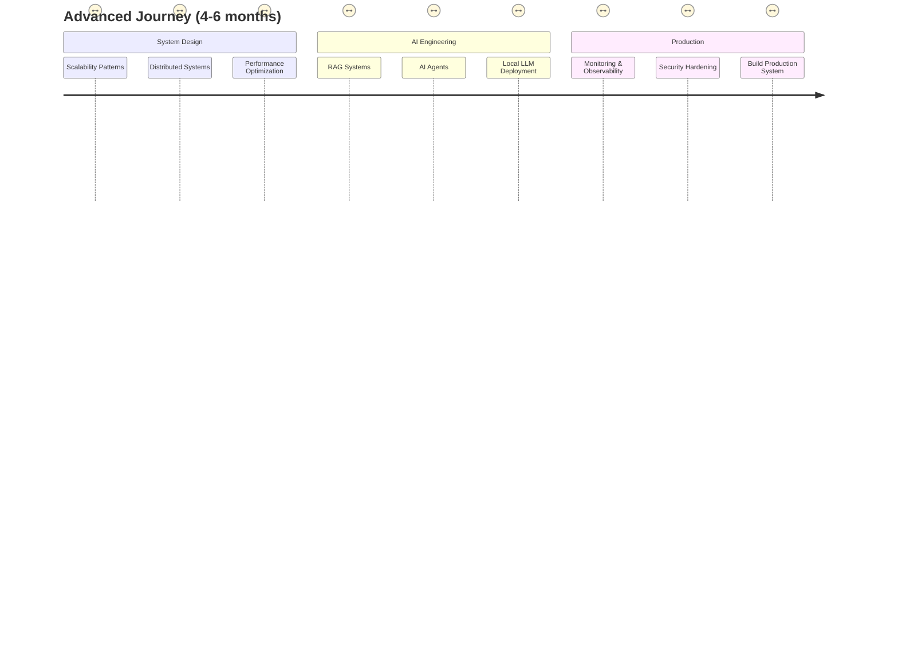

# 🚀 Vibe Coding: Zero to Hero

> **The Complete Open-Source Handbook for AI-Assisted Software Development**

[](https://opensource.org/licenses/MIT)
[](CONTRIBUTING.md)
[]()

A comprehensive, community-driven knowledge base teaching you how to build production-ready software with AI assistance—from your first "Hello World" to scalable, deployed systems.

---

## 📖 Table of Contents

- [What is Vibe Coding?](#-what-is-vibe-coding)
- [Who Is This For?](#-who-is-this-for)
- [Learning Roadmap](#-learning-roadmap)
- [Repository Structure](#-repository-structure)
- [Recommended Tech Stack](#-recommended-tech-stack)
- [AI Tooling Ecosystem](#-ai-tooling-ecosystem)
- [Getting Started](#-getting-started)
- [Community & Contributions](#-community--contributions)
- [Resources](#-resources)

---

## 🎯 What is Vibe Coding?

**Vibe Coding** is a modern software development methodology where engineers collaborate with AI systems to design, build, debug, optimize, test, deploy, and scale applications faster—while maintaining code quality and architectural integrity.

### The Vibe Coding Workflow



### What Vibe Coding Is NOT ❌

- ❌ Copy-pasting AI code blindly
- ❌ Replacing engineering fundamentals
- ❌ Skipping architecture & design
- ❌ Avoiding debugging & testing
- ❌ Ignoring security best practices

### What You Need to Master ✅

| Skill Area | Why It Matters |
|------------|----------------|
| **Software Engineering** | Fundamentals never go out of style |
| **Prompt Engineering** | Communicate intent clearly to AI |
| **System Architecture** | Design scalable, maintainable systems |
| **Debugging** | AI makes mistakes; you fix them |
| **Infrastructure** | Deploy, monitor, and scale in production |
| **Product Thinking** | Build what users actually need |
| **AI Limitations** | Know when to trust (and when not to) |

> 💡 **Goal:** Build software faster while maintaining quality.

---

## 👥 Who Is This For?

| Audience | What You'll Gain |
|----------|------------------|
| **Beginners** | Start coding with AI guidance, learn fundamentals faster |
| **Junior Developers** | Accelerate learning, build portfolio projects |
| **Senior Engineers** | Multiply productivity, explore AI-native workflows |
| **Freelancers** | Ship projects faster, take on more clients |
| **Startup Founders** | Build MVPs rapidly, validate ideas quickly |
| **Students** | Learn modern development practices early |

---

## 🗺️ Learning Roadmap

### Beginner Path 🟢



**Projects to Build:**
- ✅ Todo App with authentication
- ✅ Personal Portfolio Website
- ✅ Weather Dashboard API
- ✅ Simple Blog CMS

### Intermediate Path 🟡



**Projects to Build:**
- ✅ SaaS Starter Template
- ✅ AI-Powered Chatbot
- ✅ Real-time Dashboard
- ✅ E-commerce Platform

### Advanced Path 🔴



**Projects to Build:**
- ✅ Kubernetes-based Platform
- ✅ Multi-Agent AI System
- ✅ Vector Search Engine
- ✅ Production SaaS Product

---

## 📁 Repository Structure

This repository contains **30 comprehensive sections** covering every aspect of AI-assisted development:

### 🏁 Foundations (Sections 00-06)

| Section | Topic | Status |
|---------|-------|--------|
| [00-introduction](./00-introduction/) | Welcome & Overview | 🟡 In Progress |
| [01-what-is-vibe-coding](./01-what-is-vibe-coding/) | Philosophy & Mindset | 🟡 In Progress |
| [02-how-to-start](./02-how-to-start/) | Getting Started Guide | 🟡 In Progress |
| [03-hardware-guide](./03-hardware-guide/) | Setup Requirements | 🟡 In Progress |
| [04-ai-models](./04-ai-models/) | Model Comparison | 🟡 In Progress |
| [05-ai-tools](./05-ai-tools/) | Tool Ecosystem | 🟡 In Progress |
| [06-ides-editors](./06-ides-editors/) | AI-Native IDEs | 🟡 In Progress |

### 💻 Core Development (Sections 07-14)

| Section | Topic | Status |
|---------|-------|--------|
| [07-prompt-engineering](./07-prompt-engineering/) | **Prompt Templates & Techniques** | 🟡 In Progress |
| [08-frontend](./08-frontend/) | React, Next.js, TypeScript | 🟡 In Progress |
| [09-backend](./09-backend/) | APIs, Microservices | 🟡 In Progress |
| [10-databases](./10-databases/) | SQL, NoSQL, Vector DBs | 🟡 In Progress |
| [11-devops-cloud](./11-devops-cloud/) | Docker, K8s, Cloud | 🟡 In Progress |
| [12-hosting-platforms](./12-hosting-platforms/) | Deployment Options | 🟡 In Progress |
| [13-testing-debugging](./13-testing-debugging/) | Quality Assurance | 🟡 In Progress |
| [14-security](./14-security/) | Security Best Practices | 🟡 In Progress |

### 🚀 Advanced Topics (Sections 15-24)

| Section | Topic | Status |
|---------|-------|--------|
| [15-offline-vibe-coding](./15-offline-vibe-coding/) | **Local AI & Privacy** | 🟡 In Progress |
| [16-open-source-projects](./16-open-source-projects/) | Project Ideas | 🟡 In Progress |
| [17-real-world-workflows](./17-real-world-workflows/) | Production Workflows | 🟡 In Progress |
| [18-monetization](./18-monetization/) | Making Money | 🟡 In Progress |
| [19-freelancing](./19-freelancing/) | Client Work | 🟡 In Progress |
| [20-system-design](./20-system-design/) | Architecture Patterns | 🟡 In Progress |
| [21-mobile-development](./21-mobile-development/) | React Native, Flutter | 🟡 In Progress |
| [22-ai-agents](./22-ai-agents/) | Autonomous Agents | 🟡 In Progress |
| [23-rag-vector-databases](./23-rag-vector-databases/) | RAG Systems | 🟡 In Progress |
| [24-automation](./24-automation/) | CI/CD, Scripts | 🟡 In Progress |

### 📚 Resources (Sections 25-29)

| Section | Topic | Status |
|---------|-------|--------|
| [25-cheat-sheets](./25-cheat-sheets/) | Quick References | 🟡 In Progress |
| [26-awesome-prompts](./26-awesome-prompts/) | Prompt Library | 🟡 In Progress |
| [27-case-studies](./27-case-studies/) | Real-World Analysis | 🟡 In Progress |
| [28-failure-patterns](./28-failure-patterns/) | What NOT to Do | 🟡 In Progress |
| [29-interview-prep](./29-interview-prep/) | Interview Questions | 🟡 In Progress |

**Legend:** 🟢 Complete | 🟡 In Progress | 🔴 Planned

---

## 🛠️ Recommended Tech Stack

Based on industry trends and AI compatibility:

### Frontend Development

```
┌─────────────────────────────────────┐
│           FRONTEND STACK            │
├─────────────────────────────────────┤
│ Framework   │ React / Next.js       │
│ Language    │ TypeScript            │
│ Styling     │ TailwindCSS + Shadcn  │
│ State       │ Zustand / Redux       │
│ Testing     │ Vitest + Playwright   │
└─────────────────────────────────────┘
```

### Backend Development

```
┌─────────────────────────────────────┐
│           BACKEND STACK             │
├─────────────────────────────────────┤
│ Runtime     │ Node.js / Bun         │
│ Framework   │ Express / Fastify     │
│ Alternative │ Python (FastAPI)      │
│ Alternative │ Go                    │
│ API Style   │ REST / GraphQL        │
│ Auth        │ JWT / OAuth2          │
└─────────────────────────────────────┘
```

### DevOps & Infrastructure

```
┌─────────────────────────────────────┐
│          DEVOPS STACK               │
├─────────────────────────────────────┤
│ Containers  │ Docker                │
│ Orchestration│ Kubernetes           │
│ IaC         │ Terraform             │
│ CI/CD       │ GitHub Actions        │
│ Monitoring  │ Prometheus + Grafana  │
│ Logging     │ ELK Stack             │
└─────────────────────────────────────┘
```

### AI & Machine Learning

```
┌─────────────────────────────────────┐
│            AI STACK                 │
├─────────────────────────────────────┤
│ Local       │ Ollama + LM Studio    │
│ Cloud       │ Claude / GPT-4        │
│ Open Source │ DeepSeek / Qwen       │
│ UI          │ Open WebUI            │
│ IDE Plugin  │ Continue / Cursor     │
│ Embeddings  │ Sentence Transformers │
└─────────────────────────────────────┘
```

### Databases

| Type | Technology | Use Case |
|------|------------|----------|
| **Relational** | PostgreSQL | Primary data storage |
| **Cache** | Redis | Session management, caching |
| **Vector** | Pinecone / Qdrant | AI embeddings, RAG |
| **Document** | MongoDB | Flexible schemas |
| **Search** | Elasticsearch | Full-text search |

---

## 🤖 AI Tooling Ecosystem

### AI-Powered IDEs

| Tool | Best For | Pricing | Learning Curve |
|------|----------|---------|----------------|
| **[Cursor](https://cursor.com)** | Full AI integration | $20/mo | ⭐⭐ |
| **[Windsurf](https://windsurf.ai)** | Code understanding | Free tier | ⭐⭐ |
| **[VS Code + Continue](https://continue.dev)** | Open-source flexibility | Free | ⭐⭐⭐ |
| **[Zed](https://zed.dev)** | Speed + AI | Free | ⭐⭐ |

### AI Chat Assistants

| Tool | Strengths | Context Window | Cost |
|------|-----------|----------------|------|
| **Claude 3.5 Sonnet** | Reasoning, code quality | 200K tokens | $3/million input |
| **GPT-4o** | General purpose, tools | 128K tokens | $5/million input |
| **DeepSeek Coder** | Code specialization | 128K tokens | Free/Open |
| **Gemini 1.5 Pro** | Large context, multimodal | 2M tokens | $3.50/million input |

### Local AI Setup

```bash
# Install Ollama
curl -fsSL https://ollama.com/install.sh | sh

# Pull coding models
ollama pull deepseek-coder:6.7b
ollama pull qwen2.5-coder:7b
ollama pull llama3.1:8b

# Run with Open WebUI
docker run -d -p 3000:8080 \
  --add-host=host.docker.internal:host-gateway \
  -v open-webui:/app/backend/data \
  ghcr.io/open-webui/open-webui:main
```

---

## 🎓 Getting Started

### Step 1: Set Up Your Environment

```bash
# Clone this repository
git clone https://github.com/yourusername/vibe-coding-zero-to-hero.git
cd vibe-coding-zero-to-hero

# Install essential tools
# - Git, Node.js, Docker
# - VS Code or Cursor
# - Ollama for local AI
```

### Step 2: Choose Your Learning Path

1. **Complete Beginner?** → Start with [02-how-to-start](./02-how-to-start/)
2. **Know basics?** → Jump to [07-prompt-engineering](./07-prompt-engineering/)
3. **Ready to build?** → Check [16-open-source-projects](./16-open-source-projects/)
4. **Want local AI?** → See [15-offline-vibe-coding](./15-offline-vibe-coding/)

### Step 3: Build Your First Project

Follow the project-based learning approach:

1. Pick a project from the roadmap
2. Use AI to generate initial code
3. Understand every line (don't copy-paste blindly!)
4. Debug issues with AI assistance
5. Deploy and share your work

---

## 🤝 Community & Contributions

This is a **community-driven** project. We welcome contributions of all kinds!

### How to Contribute

- 📝 **Write guides** - Share your expertise in any section
- 🎨 **Create diagrams** - Visual explanations help everyone
- 🐛 **Report issues** - Found errors or gaps? Let us know
- 💡 **Suggest topics** - What should we cover next?
- 🔧 **Improve tooling** - Better workflows, scripts, templates

### Contribution Guidelines

1. Read our [Contributing Guide](CONTRIBUTING.md)
2. Check existing [Issues](../../issues) before starting
3. Follow our [Markdown Style Guide](CONTRIBUTING.md#markdown-standards)
4. Submit a Pull Request with clear description

### Join the Community

- 💬 Discussions: [GitHub Discussions](../../discussions)
- 🐦 Twitter: [@YourHandle](#) *(coming soon)*
- 💻 Discord: *(coming soon)*

---

## 📚 Resources

### Essential Reading

- [Blueprint.md](./Blueprint.md) - Complete vision and structure
- [ROADMAP.md](./ROADMAP.md) - Detailed learning timeline
- [RESOURCES.md](./RESOURCES.md) - Curated external links
- [CONTRIBUTING.md](./CONTRIBUTING.md) - How to contribute

### External Resources

| Category | Resource |
|----------|----------|
| **Learn Git** | [Git Handbook](https://guides.github.com/introduction/git-handbook/) |
| **Learn React** | [React Docs](https://react.dev) |
| **Learn Docker** | [Docker Docs](https://docs.docker.com) |
| **Prompt Engineering** | [Prompt Engineering Guide](https://www.promptingguide.ai) |
| **System Design** | [System Design Primer](https://github.com/donnemartin/system-design-primer) |

---

## 📄 License

This project is licensed under the [MIT License](LICENSE).

---

## 🙏 Acknowledgments

Built with ❤️ by the community, for the community.

Special thanks to all contributors making AI-assisted development accessible to everyone.

---

<div align="center">

**🚀 Ready to start vibe coding?**

[Get Started](./02-how-to-start/) · [View Roadmap](./ROADMAP.md) · [Contribute](./CONTRIBUTING.md)

</div>
